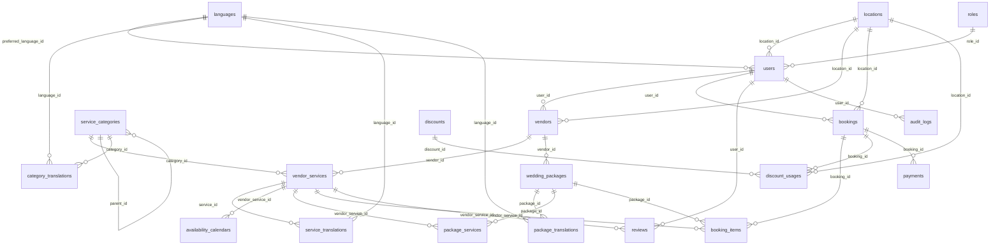

# Global Wedding & Marriage Event Management Platform (Tamil + English)

## 1) Architecture Diagram

```mermaid
flowchart LR
  subgraph Client[Web & Mobile Clients]
    A[Next.js App\n i18n (ta,en)\nLuxury Tamil Theme]
  end
  subgraph Edge[Edge & CDN]
    CDN[CDN/CloudFront]
    WAF[WAF]
  end
  subgraph API[Backend - NestJS]
    G[API Gateway / Ingress]
    S1[Services\nAuth, Users, Vendors,\nBookings, Discounts,\nPayments, Notifications]
  end
  subgraph Data[Data Layer]
    PG[(PostgreSQL RDS)]
    RD[(Redis)]
    S3[(AWS S3)]
  end
  subgraph Integrations[3rd Party]
    RZ[Razorpay]
    ST[Stripe]
    SMS[SMS]
    MAIL[Email]
    WA[WhatsApp]
  end
  subgraph Ops[Ops & Platform]
    CI[CI/CD]
    OBS[Logs & Metrics]
    SEC[Secrets Manager]
  end

  A --> CDN --> WAF --> G --> S1
  S1 --> PG
  S1 --> RD
  S1 --> S3
  S1 --> RZ
  S1 --> ST
  S1 --> SMS
  S1 --> MAIL
  S1 --> WA
  CI --> A
  CI --> S1
  S1 --> OBS
  SEC --> S1
```

## 2) Multilingual DB Schema + ER Diagram

### Rationale
- Bilingual content stored via translation tables keyed by language.
- Discount logic supports global or city scopes with strict usage tracking for “First 10 Customers”.
- Availability is date-based per vendor service with capacity.

### Core Tables (PostgreSQL)

```sql
CREATE TABLE languages (
  id SERIAL PRIMARY KEY,
  code VARCHAR(8) UNIQUE NOT NULL,
  name VARCHAR(32) NOT NULL
);

CREATE TABLE roles (
  id SERIAL PRIMARY KEY,
  name VARCHAR(32) UNIQUE NOT NULL
);

CREATE TABLE locations (
  id SERIAL PRIMARY KEY,
  country VARCHAR(64) NOT NULL,
  state VARCHAR(64),
  city VARCHAR(64),
  timezone VARCHAR(64) NOT NULL,
  currency_code VARCHAR(8) NOT NULL
);

CREATE TABLE users (
  id SERIAL PRIMARY KEY,
  role_id INT REFERENCES roles(id),
  location_id INT REFERENCES locations(id),
  name VARCHAR(128) NOT NULL,
  email VARCHAR(256) UNIQUE NOT NULL,
  phone VARCHAR(32),
  preferred_language_id INT REFERENCES languages(id),
  password_hash VARCHAR(256) NOT NULL,
  created_at TIMESTAMP NOT NULL DEFAULT NOW(),
  updated_at TIMESTAMP NOT NULL DEFAULT NOW()
);

CREATE INDEX idx_users_email ON users(email);
CREATE INDEX idx_users_location ON users(location_id);

CREATE TABLE vendors (
  id SERIAL PRIMARY KEY,
  user_id INT REFERENCES users(id),
  location_id INT REFERENCES locations(id),
  name VARCHAR(128) NOT NULL,
  description TEXT,
  rating NUMERIC(3,2) DEFAULT 0,
  created_at TIMESTAMP NOT NULL DEFAULT NOW()
);
CREATE INDEX idx_vendors_location ON vendors(location_id);

CREATE TABLE service_categories (
  id SERIAL PRIMARY KEY,
  key VARCHAR(64) UNIQUE NOT NULL,
  icon VARCHAR(128),
  parent_id INT REFERENCES service_categories(id)
);

CREATE TABLE category_translations (
  id SERIAL PRIMARY KEY,
  category_id INT REFERENCES service_categories(id) ON DELETE CASCADE,
  language_id INT REFERENCES languages(id),
  name VARCHAR(128) NOT NULL,
  description TEXT,
  UNIQUE(category_id, language_id)
);

CREATE TABLE vendor_services (
  id SERIAL PRIMARY KEY,
  vendor_id INT REFERENCES vendors(id) ON DELETE CASCADE,
  category_id INT REFERENCES service_categories(id),
  base_price NUMERIC(12,2) NOT NULL,
  pricing_model VARCHAR(32) NOT NULL,
  city_pricing JSONB,
  currency_code VARCHAR(8) NOT NULL,
  created_at TIMESTAMP NOT NULL DEFAULT NOW()
);
CREATE INDEX idx_vendor_services_cat ON vendor_services(category_id);
CREATE INDEX idx_vendor_services_vendor ON vendor_services(vendor_id);

CREATE TABLE service_translations (
  id SERIAL PRIMARY KEY,
  service_id INT REFERENCES vendor_services(id) ON DELETE CASCADE,
  language_id INT REFERENCES languages(id),
  name VARCHAR(128) NOT NULL,
  description TEXT,
  features JSONB,
  UNIQUE(service_id, language_id)
);

CREATE TABLE availability_calendars (
  id SERIAL PRIMARY KEY,
  vendor_service_id INT REFERENCES vendor_services(id) ON DELETE CASCADE,
  date DATE NOT NULL,
  is_available BOOLEAN NOT NULL DEFAULT TRUE,
  capacity INT,
  UNIQUE(vendor_service_id, date)
);
CREATE INDEX idx_availability_date ON availability_calendars(date);

CREATE TABLE wedding_packages (
  id SERIAL PRIMARY KEY,
  tier VARCHAR(16) NOT NULL,
  vendor_id INT REFERENCES vendors(id),
  base_price NUMERIC(12,2) NOT NULL,
  currency_code VARCHAR(8) NOT NULL
);

CREATE TABLE package_translations (
  id SERIAL PRIMARY KEY,
  package_id INT REFERENCES wedding_packages(id) ON DELETE CASCADE,
  language_id INT REFERENCES languages(id),
  name VARCHAR(128) NOT NULL,
  description TEXT,
  UNIQUE(package_id, language_id)
);

CREATE TABLE package_services (
  id SERIAL PRIMARY KEY,
  package_id INT REFERENCES wedding_packages(id) ON DELETE CASCADE,
  vendor_service_id INT REFERENCES vendor_services(id),
  quantity INT DEFAULT 1,
  notes TEXT
);

CREATE TABLE bookings (
  id SERIAL PRIMARY KEY,
  user_id INT REFERENCES users(id),
  location_id INT REFERENCES locations(id),
  wedding_date DATE NOT NULL,
  timezone VARCHAR(64) NOT NULL,
  currency_code VARCHAR(8) NOT NULL,
  status VARCHAR(32) NOT NULL,
  requires_vendor_approval BOOLEAN NOT NULL DEFAULT FALSE,
  total_amount NUMERIC(12,2) NOT NULL DEFAULT 0,
  discount_amount NUMERIC(12,2) NOT NULL DEFAULT 0,
  created_at TIMESTAMP NOT NULL DEFAULT NOW()
);
CREATE INDEX idx_bookings_date_city ON bookings(wedding_date, location_id);

CREATE TABLE booking_items (
  id SERIAL PRIMARY KEY,
  booking_id INT REFERENCES bookings(id) ON DELETE CASCADE,
  vendor_service_id INT REFERENCES vendor_services(id),
  package_id INT REFERENCES wedding_packages(id),
  event_date DATE,
  quantity INT NOT NULL DEFAULT 1,
  unit_price NUMERIC(12,2) NOT NULL,
  item_total NUMERIC(12,2) NOT NULL
);

CREATE TABLE discounts (
  id SERIAL PRIMARY KEY,
  name VARCHAR(128) NOT NULL,
  enabled BOOLEAN NOT NULL DEFAULT FALSE,
  scope VARCHAR(16) NOT NULL,
  location_id INT REFERENCES locations(id),
  type VARCHAR(16) NOT NULL,
  value NUMERIC(12,2) NOT NULL,
  max_uses INT NOT NULL DEFAULT 10,
  applies_to VARCHAR(16) NOT NULL,
  start_time TIMESTAMP,
  end_time TIMESTAMP
);
CREATE INDEX idx_discounts_scope ON discounts(scope, location_id);

CREATE TABLE discount_usages (
  id SERIAL PRIMARY KEY,
  discount_id INT REFERENCES discounts(id) ON DELETE CASCADE,
  booking_id INT REFERENCES bookings(id) ON DELETE CASCADE,
  location_id INT REFERENCES locations(id),
  created_at TIMESTAMP NOT NULL DEFAULT NOW()
);
CREATE INDEX idx_discount_usage ON discount_usages(discount_id, location_id);

CREATE TABLE payments (
  id SERIAL PRIMARY KEY,
  booking_id INT REFERENCES bookings(id) ON DELETE CASCADE,
  provider VARCHAR(16) NOT NULL,
  provider_payment_id VARCHAR(128),
  amount NUMERIC(12,2) NOT NULL,
  currency_code VARCHAR(8) NOT NULL,
  status VARCHAR(32) NOT NULL,
  receipt_url TEXT,
  created_at TIMESTAMP NOT NULL DEFAULT NOW()
);

CREATE TABLE reviews (
  id SERIAL PRIMARY KEY,
  user_id INT REFERENCES users(id),
  vendor_service_id INT REFERENCES vendor_services(id) ON DELETE CASCADE,
  rating INT NOT NULL,
  comment TEXT,
  created_at TIMESTAMP NOT NULL DEFAULT NOW()
);
CREATE INDEX idx_reviews_vendor ON reviews(vendor_service_id);

CREATE TABLE audit_logs (
  id SERIAL PRIMARY KEY,
  user_id INT REFERENCES users(id),
  action VARCHAR(64) NOT NULL,
  entity_type VARCHAR(64) NOT NULL,
  entity_id INT,
  metadata JSONB,
  created_at TIMESTAMP NOT NULL DEFAULT NOW()
);
```

### ER Diagram (Mermaid)



## 3) REST APIs for Booking & Discounts

### Base
- Versioned: `/api/v1`
- Auth: JWT for customers and vendors; role-based access for admin.

### Services
- GET `/api/v1/services?category=<key>&city=<city>&lang=<ta|en>`
- GET `/api/v1/services/:id?lang=<ta|en>`

### Packages
- GET `/api/v1/packages?tier=<basic|premium|luxury>&city=<city>&lang=<ta|en>`
- GET `/api/v1/packages/:id?lang=<ta|en>`

### Availability
- GET `/api/v1/services/:id/availability?date=YYYY-MM-DD`
- POST `/api/v1/services/:id/availability` (vendor)

### Bookings
- POST `/api/v1/bookings`
  - Body: user_id, location_id, wedding_date, timezone, currency_code, requires_vendor_approval, items[]
  - Applies discount automatically when eligible
- GET `/api/v1/bookings/:id`
- PATCH `/api/v1/bookings/:id/status` (admin/vendor)

### Discounts
- GET `/api/v1/discounts/active?city=<city>`
- GET `/api/v1/discounts/:id/remaining?city=<city>`
- POST `/api/v1/admin/discounts` (admin)
- PATCH `/api/v1/admin/discounts/:id` (admin)
- POST `/api/v1/admin/discounts/:id/toggle` (admin)

### Payments
- POST `/api/v1/payments/razorpay/create-order`
- POST `/api/v1/payments/stripe/create-session`
- POST `/api/v1/payments/confirm`

## 4) Discount Logic: “First 10 Customers”

### Rules
- Scope: global or city
- Type: flat or percentage
- Applies across bundled and individual services
- Auto-applied at checkout when enabled and remaining slots exist

### Pseudocode

```ts
type DiscountScope = "global" | "city";
type DiscountType = "flat" | "percent";

interface Discount {
  id: number;
  enabled: boolean;
  scope: DiscountScope;
  location_id?: number;
  type: DiscountType;
  value: number;
  max_uses: number;
}

interface BookingItem {
  unit_price: number;
  quantity: number;
}

function computeSubtotal(items: BookingItem[]): number {
  return items.reduce((acc, it) => acc + it.unit_price * it.quantity, 0);
}

function computeDiscount(subtotal: number, d: Discount): number {
  if (!d.enabled) return 0;
  if (d.type === "flat") return Math.min(d.value, subtotal);
  return Math.floor((d.value / 100) * subtotal);
}

function remainingSlots(discountId: number, scope: DiscountScope, locationId?: number): number {
  return 10;
}

function applyFirstTenDiscount(items: BookingItem[], discount: Discount, scope: DiscountScope, locationId?: number) {
  const subtotal = computeSubtotal(items);
  const remaining = remainingSlots(discount.id, scope, locationId);
  if (remaining <= 0) return { subtotal, discount_amount: 0, total: subtotal };
  const discount_amount = computeDiscount(subtotal, discount);
  const total = subtotal - discount_amount;
  return { subtotal, discount_amount, total };
}
```

## 5) Sample Bilingual UI Screens (Next.js)

### Language Toggle and i18n

```ts
// app/i18n/config.ts
export const languages = ["en", "ta"] as const;
export type Lang = (typeof languages)[number];
export const defaultLang: Lang = "en";

export const translations: Record<Lang, Record<string, string>> = {
  en: {
    title: "Tamil Wedding Booking",
    services: "Services",
    packages: "Packages",
    bookNow: "Book Now",
    discountApplied: "Discount Applied",
  },
  ta: {
    title: "தமிழ் திருமணம் பதிவு",
    services: "சேவைகள்",
    packages: "திட்டங்கள்",
    bookNow: "இப்போது பதிவு செய்யவும்",
    discountApplied: "தள்ளுபடி பொருந்தியது",
  },
};
```

```ts
// app/components/LanguageToggle.tsx
import { useState } from "react";
import { languages, translations, defaultLang } from "../i18n/config";

export default function LanguageToggle() {
  const [lang, setLang] = useState(defaultLang);
  return (
    <div>
      <select value={lang} onChange={(e) => setLang(e.target.value as any)}>
        {languages.map((l) => (
          <option key={l} value={l}>{l.toUpperCase()}</option>
        ))}
      </select>
      <h1>{translations[lang].title}</h1>
    </div>
  );
}
```

### Services Listing (Tamil-friendly UX, Gold/Maroon/Ivory)

```ts
// app/services/page.tsx
import { translations } from "../i18n/config";

export default function ServicesPage() {
  const lang = "ta";
  const T = translations[lang];
  const categories = [
    { key: "venues", ta: "மணமக்கள் மண்டபங்கள்", en: "Venues" },
    { key: "catering", ta: "உணவுச்சேவை", en: "Catering" },
    { key: "decoration", ta: "அலங்காரம்", en: "Decoration" },
    { key: "photo", ta: "புகைப்படம்", en: "Photography" },
  ];
  return (
    <div style={{ background: "#fff8e1", color: "#7b1f1f" }}>
      <h2>{T.services}</h2>
      <div style={{ display: "grid", gridTemplateColumns: "repeat(2, 1fr)", gap: 16 }}>
        {categories.map((c) => (
          <div key={c.key} style={{ border: "1px solid #b8860b", padding: 16, borderRadius: 8 }}>
            <div style={{ fontFamily: "Tamil MN, Noto Serif Tamil" }}>{lang === "ta" ? c.ta : c.en}</div>
            <button style={{ background: "#b8860b", color: "#fff", padding: "8px 12px" }}>
              Book
            </button>
          </div>
        ))}
      </div>
    </div>
  );
}
```

### Booking Summary with Discount

```ts
// app/booking/page.tsx
type Item = { name: string; unit_price: number; quantity: number };
const items: Item[] = [
  { name: "Marriage Hall", unit_price: 50000, quantity: 1 },
  { name: "Catering (per-head)", unit_price: 800, quantity: 300 },
];

function subtotal(items: Item[]) {
  return items.reduce((acc, it) => acc + it.unit_price * it.quantity, 0);
}

export default function BookingPage() {
  const s = subtotal(items);
  const discount = Math.min(10000, s);
  const total = s - discount;
  return (
    <div style={{ padding: 24 }}>
      <h2>Booking Summary</h2>
      <ul>
        {items.map((it) => (
          <li key={it.name}>{it.name}: ₹{it.unit_price} × {it.quantity}</li>
        ))}
      </ul>
      <div>Subtotal: ₹{s}</div>
      <div style={{ color: "green" }}>Discount: -₹{discount}</div>
      <div>Total: ₹{total}</div>
      <button>Pay</button>
    </div>
  );
}
```

## 6) Backend (NestJS) Sample Endpoints

### Controller Stubs

```ts
// src/discounts/discounts.controller.ts
import { Controller, Get, Param, Query } from "@nestjs/common";
import { DiscountsService } from "./discounts.service";

@Controller("api/v1/discounts")
export class DiscountsController {
  constructor(private readonly svc: DiscountsService) {}

  @Get("active")
  findActive(@Query("city") city?: string) {
    return this.svc.findActive(city);
  }

  @Get(":id/remaining")
  remaining(@Param("id") id: string, @Query("city") city?: string) {
    return this.svc.remaining(parseInt(id, 10), city);
  }
}
```

```ts
// src/bookings/bookings.controller.ts
import { Controller, Get, Post, Param, Body } from "@nestjs/common";
import { BookingsService } from "./bookings.service";

@Controller("api/v1/bookings")
export class BookingsController {
  constructor(private readonly svc: BookingsService) {}

  @Get(":id")
  getById(@Param("id") id: string) {
    return this.svc.getById(parseInt(id, 10));
  }

  @Post()
  create(@Body() dto: any) {
    return this.svc.create(dto);
  }
}
```

### Service Logic

```ts
// src/discounts/discounts.service.ts
export class DiscountsService {
  async findActive(city?: string) {
    return { id: 1, enabled: true, scope: city ? "city" : "global", location_id: null, type: "flat", value: 10000, max_uses: 10 };
  }
  async remaining(id: number, city?: string) {
    return { id, remaining: 7 };
  }
}
```

```ts
// src/bookings/bookings.service.ts
type Item = { unit_price: number; quantity: number };

export class BookingsService {
  async getById(id: number) {
    return { id, status: "confirmed" };
  }
  async create(dto: any) {
    const subtotal = dto.items.reduce((acc: number, it: Item) => acc + it.unit_price * it.quantity, 0);
    const discount = Math.min(10000, subtotal);
    const total = subtotal - discount;
    return { id: 1001, subtotal, discount_amount: discount, total, status: dto.requires_vendor_approval ? "vendor_approval" : "confirmed" };
  }
}
```

## 7) Cloud Deployment Steps (AWS)

- Create ECR repositories for api and web.
- Provision RDS PostgreSQL and ElastiCache Redis in same VPC.
- Create S3 bucket for media assets; enable lifecycle policies and public access via CloudFront.
- Build Docker images for NestJS API and Next.js web, push to ECR.
- Create ECS Fargate services behind an Application Load Balancer; configure target groups for api and web.
- Set environment variables via AWS Secrets Manager for DB, payments, SMTP, WhatsApp.
- Attach WAF to CloudFront and ALB; enable TLS with ACM certificates.
- Configure CI/CD to build and deploy on main branch merges.

## 8) Docker for Local Dev

```yaml
version: "3.9"
services:
  postgres:
    image: postgres:16
    environment:
      POSTGRES_PASSWORD: wedding
      POSTGRES_USER: wedding
      POSTGRES_DB: wedding
    ports:
      - "5432:5432"
  redis:
    image: redis:7
    ports:
      - "6379:6379"
```

## 9) Notifications

- SMS: template-based booking confirmations with Tamil text for local users.
- Email: bilingual emails using dynamic templates with locale detection.
- WhatsApp: opt-in booking updates and reminders.

## 10) Security & Scalability

- Auth: JWT with role-based authorization; refresh tokens stored securely.
- Secrets: Managed in AWS Secrets Manager; never hardcode keys.
- OWASP: Input validation, rate limiting, CSRF protection on web forms.
- Data: Row-level policies for vendor-owned records; audit logging on admin actions.
- Performance: Redis caching for service catalog and availability; CDN for static assets.
- Scale: Stateless API scaling via ECS; DB read replicas; background workers for notifications.
- Observability: Structured logs, metrics dashboards, tracing with ID propagation.

## 11) UX Guidelines

- Palette: Gold (#b8860b), Maroon (#7b1f1f), Ivory (#fff8e1).
- Fonts: Tamil MN or Noto Serif Tamil; large sizes for readability.
- Mobile-first grids and large tappable controls suitable for elders.

## 12) Payments

- Providers: Razorpay (INR) and Stripe (multi-currency).
- Flow: Create order/session, confirm payment, record payment, update booking.

## 13) Predefined Core Categories

- Venues: marriage halls, convention centers, outdoor, destination.
- Catering: veg/non-veg, regional menus, banana leaf, live counters.
- Decoration: stage, floral, mandapam, reception themes, lighting.
- Photography & Videography: traditional, candid, cinematic, drone, albums.
- Makeup & Styling: bridal, groom, family, hair and draping.
- Music & Entertainment: DJ, live band, nadaswaram, chenda, sangeet.
- Ritual & Religious: pandit/iyer, muhurtham, homam/pooja, materials.
- Planning & Coordination: full, partial, day-of coordination.
- Logistics & Support: transport, car rentals, generators, security, valet.
- Invitations & Gifts: printed, digital, return gifts, hampers.

## 14) Admin Views

- Toggle discounts and view remaining slots global or per city.
- Manage vendors, services, packages, pricing rules, availability.
- Review bookings requiring vendor approval and confirm or reject.

---

This document aggregates architecture, schema, REST API outlines, sample bilingual UI, deployment steps, and security guidance to bootstrap a production-ready Tamil + English wedding platform.

